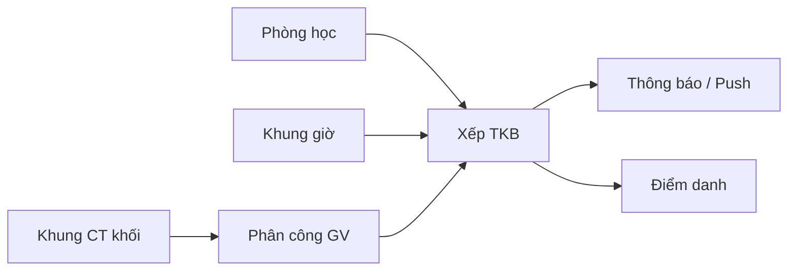
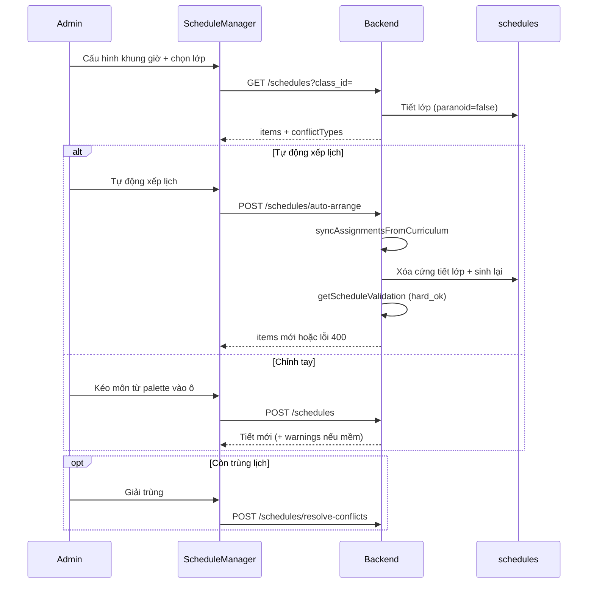
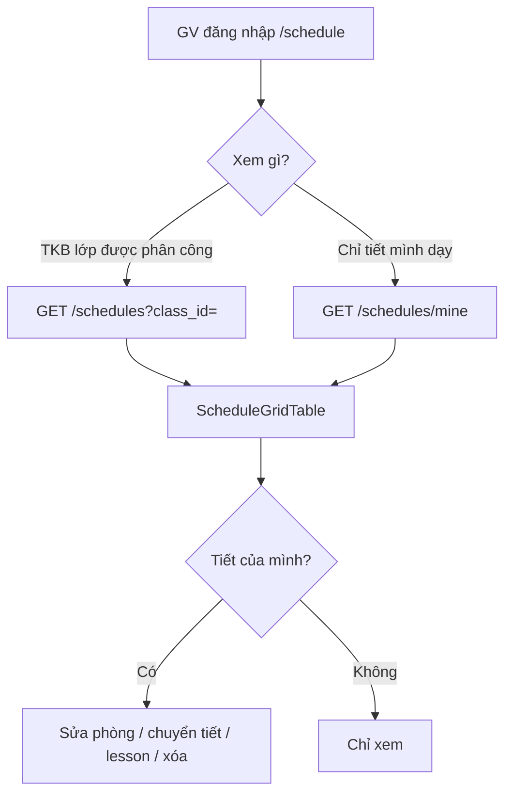
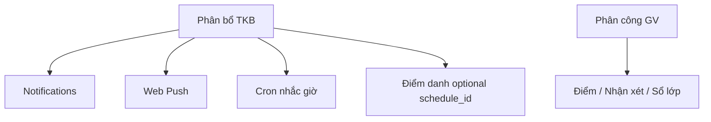

# Module phân bổ thời khóa biểu (TKB)

Tài liệu mô tả **luồng nghiệp vụ**, **đặc tả chức năng**, **phụ thuộc module khác** và **ảnh hưởng theo vai trò** trong EduSmart v1.1.

| Thành phần | Đường dẫn chính |
|------------|----------------|
| UI Admin | `/admin/schedules` — `ScheduleManager.jsx` |
| UI GV / HS / PH | `/schedule` — `Schedule.jsx` |
| API | `/api/schedules/*`, `/api/timetable-config`, `/api/push/*` |
| Service | `backend/src/services/schedule.service.js` |
| Thông báo | `schedule-notify.service.js`, `push-notification.service.js` |
| Cron nhắc giờ | `backend/jobs/schedule-reminder.job.js` (`ENABLE_SCHEDULE_CRON=1`) |

---

## 1. Mục tiêu module

- Xếp **tiết học** (môn + GV + phòng + ca sáng/chiều) vào **lưới tuần** theo lớp và năm học.
- Đảm bảo **ràng buộc cứng** (một ô lớp, một khung giờ GV, phòng không trùng).
- Cung cấp TKB cho **GV** (dạy / chỉnh tiết), **HS/PH** (xem, nhắc giờ, học trực tuyến).
- Phát **thông báo** khi TKB thay đổi.

Một **tiết** (`schedules`) = `(class_id, subject_id, teacher_id, day_of_week, session, period, school_year)` + metadata (`room`, `room_id`, `delivery_mode`, `lesson_topic`, …).

---

## 2. Module phụ thuộc (phải có trước khi xếp TKB)

| Module | API / trang | Vai trò với TKB |
|--------|-------------|-----------------|
| **Khung chương trình khối** | `/admin/curriculum`, `GET/PUT /api/curriculum-standards` | Định mức `periods_per_week` theo khối + môn (vd. Toán 4 tiết). Là chuẩn khi đồng bộ phân công và khi kiểm tra validation. |
| **Phân công giáo viên** | `/admin/assignments`, `GET/POST /api/assignments` | Mỗi bản ghi = GV dạy môn X cho lớp Y, `periods_per_week`. Không có phân công → không sinh / không kéo môn vào lưới. |
| **Khung giờ** | Trên `/admin/schedules`, `GET/PUT /api/timetable-config` | Ngày dạy (T2–CN), số tiết ca sáng/chiều (≤ 5), bật ca chiều. Quyết định **số ô lưới** (`grid_slots`). |
| **Phòng học** | `/admin/rooms`, `GET/POST /api/rooms` | Dùng khi sinh TKB tự động (`room_id`, loại phòng Lab/Tin…). CRUD tay có thể ghi `room` text. |
| **Lớp / năm học** | `/admin/classes` | `class_id`, `grade_level` (để tra khung CT). |

---

## 3. Luồng tổng thể (Admin)

**Thứ tự khuyến nghị:** Khung CT → Phòng → Khung giờ → Phân công GV → **Tự động xếp lịch** (từng lớp) → chỉnh tay / giải trùng nếu cần.

> **Ghi chú UI (hiện tại):** Các nút «Sinh lại từ đầu», «Sinh TKB toàn trường», «Xếp lại lớp/trường» đã **gỡ khỏi giao diện**; API tương ứng vẫn tồn tại cho script/seed (`/generate`, `/repack`, …).

---

## 4. Đặc tả chức năng — Admin (`/admin/schedules`)

### 4.1. Khung giờ

| Mục | Mô tả |
|-----|--------|
| **Mục đích** | Xác định lưới ngày × tiết × ca (sáng/chiều). |
| **Thao tác** | Chọn ngày dạy, số tiết ca sáng/chiều, bật ca chiều → **Lưu khung giờ**. |
| **API** | `GET/PUT /api/timetable-config?school_year=` |
| **Ràng buộc** | Mỗi ca tối đa **5** tiết (`MAX_PERIODS_PER_SESSION`). |
| **Ảnh hưởng** | Đổi khung giờ có thể khiến tổng tiết yêu cầu > `grid_slots` → tự động xếp báo thiếu ô. |

### 4.2. Tải TKB lớp + palette môn

| Mục | Mô tả |
|-----|--------|
| **Mục đích** | Hiển thị lưới tiết đã xếp và danh sách môn kéo-thả (từ phân công GV). |
| **API** | `GET /api/schedules?class_id=&school_year=`; `GET /api/assignments?class_id=` |
| **Dữ liệu** | `items[]` kèm `subject`, `teacher`, `conflictTypes`; palette = phân công + số tiết đã xếp/thiếu (từ validation). |
| **Lưu ý kỹ thuật** | Bảng `schedules` **không soft-delete**; xóa tiết = xóa hẳn DB (tránh unique index “ma”). |

### 4.3. Tự động xếp lịch (chức năng chính)

| Mục | Mô tả |
|-----|--------|
| **Mục đích** | Một thao tác: đồng bộ phân công theo khung CT → xóa hết tiết lớp → sinh lại → chỉ thành công khi `hard_ok`. |
| **API** | `POST /api/schedules/auto-arrange` body: `{ class_id, school_year }` |
| **Backend** | `autoArrangeClassSchedule`: `syncAssignmentsFromCurriculum` → `generateClassSchedule(clearExisting: true)` → `getScheduleValidation` |
| **Điều kiện thất bại** | Thiếu tiết sau xếp, còn trùng GV/lớp/phòng, tổng tiết > ô lưới. |
| **UI** | Nút luôn bật khi đã chọn lớp (không chặn trước bởi lệch CT toàn trường). |

### 4.4. Kéo-thả / CRUD tiết (chỉnh tay)

| Thao tác | UI | API | Ghi chú |
|----------|-----|-----|---------|
| Thêm tiết | Kéo môn+GV từ palette vào ô trống | `POST /schedules` | Kiểm tra phân công GV; `assertHardSlotFree` (ô lớp/GV/phòng). |
| Di chuyển | Kéo tiết sang ô khác | `PATCH /schedules/:id/move` | Một ô lớp một tiết. |
| Xóa | Kéo vào vùng đỏ / nút × | `DELETE /schedules/:id` | `force: true` (xóa cứng). |
| Sửa phòng & nội dung | Modal **Sửa tiết** | `PUT /schedules/:id`, `PATCH /schedules/:id/lesson` | Online bắt buộc URL hợp lệ. |

### 4.5. Kiểm tra & giải trùng

| Chức năng | API | Đầu ra chính |
|-----------|-----|--------------|
| Kiểm tra lớp | `GET /schedules/validation?class_id=` | `total_required`, `total_placed`, `conflict_count`, `curriculum_ok`, `can_generate` |
| Kiểm tra toàn trường | `GET /schedules/validation-school` | `schedule_hard_ok`, `curriculum_ok`, `curriculum_issues[]`, `schedule_violations[]` |
| Giải trùng | `POST /schedules/resolve-conflicts` | Chỉ **dời** các tiết đang conflict (`repackAll: false`) |

### 4.6. API nền (không trên UI Admin, dùng seed/tích hợp)

| API | Hành vi |
|-----|---------|
| `POST /schedules/generate` | Sinh lại TKB **một lớp** (không tự đồng bộ CT). |
| `POST /schedules/generate-school` | Xóa + sinh **toàn trường**; có thể gửi thông báo lớp. |
| `POST /schedules/repack` | Đổi vị trí **mọi** tiết một lớp. |
| `POST /schedules/repack-school` | Đổi vị trí toàn trường. |

---

## 5. Ràng buộc cứng & mềm

| Loại | Quy tắc | Khi vi phạm |
|------|---------|------------|
| **Cứng — ô lớp** | Tối đa 1 tiết / `(class, day, session, period)` | API 400 «Ô lớp này đã có tiết học» |
| **Cứng — ô GV** | Tối đa 1 tiết / `(teacher, day, session, period)` toàn trường | API 400 «Giáo viên đã có tiết…» |
| **Cứng — phòng** | Cùng `room` không trùng khung giờ | API 400 «Phòng đã được sử dụng…» |
| **Khung CT** | `periods_per_week` phân công = chuẩn khối (sau sync) | Validation `curriculum_ok`; auto-arrange sync trước khi sinh |
| **Mềm — cảnh báo** | `annotateConflicts` | Ô đỏ trên lưới; vẫn có thể lưu với `warnings` (tùy endpoint) |
| **Tải GV** | `MAX_PERIODS_PER_WEEK` | Cảnh báo khi vượt (không chặn tạo tay mặc định) |

---

## 6. Luồng GV / HS / PH (`/schedule`)

### 6.1. Giáo viên (`role: subject`)

Hệ thống phân biệt **persona** qua `GET /auth/me` → `capabilities` (GVCN = `homeroom_teacher_id`, GVBM = chỉ `assignments`).

| Chức năng | GVCN | GVBM | API |
|-----------|------|------|-----|
| Xem TKB lớp CN | Có (lớp chủ nhiệm) | — | `list` + `assertTeacherClassAccess` |
| Xem TKB lớp được dạy | Có | Có | `list` nếu có phân công lớp đó |
| Xem mọi tiết mình dạy (mọi lớp) | Có | Có | `GET /schedules/mine` |
| Thêm / đổi / xóa tiết | Chỉ tiết `teacher_id = mình` | Giống | `create`, `move`, `remove`, `patchLesson` |
| Thêm từ phân công | Có (lớp + môn đã phân công) | Có | `create` + `assertTeacherAssignment` |

**Ảnh hưởng khi Admin đổi TKB:** GV thấy lưới mới sau F5; không nhận push mặc định (push nhắm HS/PH).

### 6.2. Học sinh & phụ huynh

| Chức năng | HS | PH | API / UI |
|-----------|----|----|----------|
| Xem TKB lớp | Lớp mình | Lớp con đang chọn | `GET /schedules/my-class` |
| DTO tiết | `slot_id`, môn, GV, phòng+campus, online/offline, chủ đề, nhắc BT | Giống | `StudentScheduleView`, `ScheduleSlotDetail` |
| Vào lớp online | Nút link nếu `delivery_mode=online` | Xem qua con | `online_meeting_url` |
| Nhắc trước giờ | Web Push 15/30 phút | — (chủ yếu HS) | `useWebPush`, cron + `period_times` |
| Thông báo đổi lịch | In-app + push | In-app + push | `type=schedule`, `notifyClassScheduleChange` |

**Không được:** tạo/sửa/xóa tiết, xem TKB lớp khác.

---

## 7. Ảnh hưởng lên module khác

| Module | Cách TKB ảnh hưởng |
|--------|-------------------|
| **Thông báo in-app** | Mỗi thay đổi tiết (move, lesson, generate-school…) → `Notification` `type=schedule` cho HS/PH lớp. |
| **Web Push** | Cùng payload; cần `VAPID_*` env và HS đăng ký `/api/push/subscribe`. |
| **Cron nhắc giờ** | `schedule-reminder.job` đọc TKB + `timetable_config.period_times`; gửi push trước giờ học (`ENABLE_SCHEDULE_CRON=1`). |
| **Điểm danh** | `attendance` có thể gắn `schedule_id` — đổi/xóa tiết làm mất liên kết tùy dữ liệu. |
| **Chat / AI staff** | Thống kê có thể đếm tiết/TKB; không sửa TKB. |
| **Điểm / nhận xét / sổ lớp** | Phụ thuộc `subject_id` + `class_id` từ **phân công**, không trực tiếp từ ô TKB; đổi TKB không đổi quyền chấm điểm. |

---

## 8. Ảnh hưởng theo vai trò (tóm tắt)

| Vai trò | Trang | Quyền TKB | Khi Admin xếp/đổi TKB |
|---------|-------|-----------|------------------------|
| **Admin** | `/admin/schedules` | Toàn quyền: khung giờ, auto-arrange, kéo-thả, giải trùng, sửa mọi tiết | — |
| **GVCN** (`subject` + chủ nhiệm) | `/schedule` | Xem lớp CN + lớp dạy; sửa tiết **mình** dạy; thêm tiết theo phân công | Xem lại lưới; nhận thay đổi như GV |
| **GVBM** (`subject`, chỉ bộ môn) | `/schedule` | Xem lớp có phân công; «chỉ tiết mình»; sửa/xóa tiết mình | Giống GVCN trên lớp mình dạy |
| **Học sinh** | `/schedule` | Chỉ xem DTO lớp mình; push nhắc & đổi lịch | Thông báo + push; cập nhật lưới & chi tiết tiết |
| **Phụ huynh** | `/schedule` | Xem TKB con đang chọn | Thông báo in-app/push (theo liên kết PH–HS) |

---

## 9. DTO tiết học (view học sinh)

Trả về từ `GET /schedules/my-class` hoặc `?view=student` (qua `schedule-enrichment.service`):

| Trường | Ý nghĩa |
|--------|---------|
| `slot_id` | ID tiết |
| `subject`, `teacher_name` | Môn, tên GV |
| `room`, `campus` | Phòng (từ `room` hoặc `roomRef`) |
| `delivery_mode` | `offline` / `online` |
| `online_meeting_url` | Link lớp online |
| `lesson_topic`, `homework_reminder` | Nội dung tiết |
| `day_of_week`, `session`, `period` | Vị trí trên lưới |

GV/Admin cập nhật qua `PATCH /schedules/:id/lesson`.

---

## 10. Cấu hình vận hành

| Biến môi trường | Tác dụng |
|-----------------|----------|
| `CURRENT_SCHOOL_YEAR` | Mặc định `2024-2025` trên API/UI |
| `VAPID_PUBLIC_KEY` / `VAPID_PRIVATE_KEY` | Web Push |
| `ENABLE_SCHEDULE_CRON=1` | Bật cron nhắc trước giờ học |

**Khởi động backend:** gọi `purgeGhostSchedules()` một lần để dọn bản ghi soft-delete cũ (trước khi model tắt paranoid).

---

## 11. Tài liệu liên quan

- [ACCOUNTS.md](./ACCOUNTS.md) — tài khoản demo.
- [FLOWS.md](./FLOWS.md) — luồng hệ thống (mục TKB).
- [UI_GUIDE.md](./UI_GUIDE.md) — hướng dẫn thao tác UI.

---

*Cập nhật theo codebase EduSmart — module phân bổ TKB, UI Admin đã tối giản còn «Tự động xếp lịch» + chỉnh tay + «Giải trùng».*
